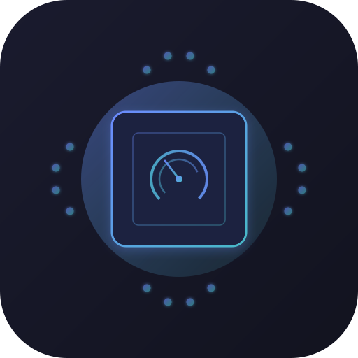

<div align="center">
  
  
  <h1>Popage</h1>
  <p>A sleek, modern hardware configuration and monitoring tool built specifically for Pop!_OS and Linux gaming laptops.</p>

  <p>
    <a href="#features">Features</a> •
    <a href="#compatibility">Compatibility</a> •
    <a href="#installation">Installation</a> •
    <a href="#building-from-source">Build from Source</a> •
    <a href="#contributing">Contributing</a>
  </p>
</div>

---

## 🚀 Features

Popage is an Electron + React application designed to replace multiple disparate terminal commands and GNOME extensions with a single, beautiful dashboard. It offers real-time monitoring and deeply integrated system controls:

### 📊 Real-time Dashboard
- **Comprehensive Hardware Metrics:** Monitor CPU, GPU, VRAM, and System RAM usage, clocks, and temperatures.
- **Detailed Power Consumption:** Uses Intel RAPL to read hardware-level package, core, and iGPU wattage, alongside dGPU and battery discharge rates.
- **GPU Process List:** Instantly view which processes are running on your discrete GPU (with scrollable list and memory usage).
- **Battery Health:** View exact battery capacity, cycles, voltage, and current status.

### ⚙️ System Controls
- **Graphics Modes:** Easily switch between Hybrid, Integrated, Compute, and NVIDIA modes via `system76-power`.
- **Power Profiles:** Toggle between Battery Life, Balanced, and Performance modes.
- **NVIDIA PowerMizer:** Fine-tune your GPU performance level (Auto, Max Performance, Adaptive).
- **Battery Conservation:** Enable/disable Lenovo Vantage-style conservation mode directly from Linux to keep your battery at ~80% and extend lifespan.

---

## 💻 Compatibility

Popage was built primarily for modern Linux systems running proprietary hardware controllers, specifically targeting System76 tools and Lenovo laptops.

**Tested Exclusively On:**
- **Lenovo LOQ 15IAX9E** (Intel Core i7-12650HX + NVIDIA RTX 4050)
- **OS:** Pop!_OS 22.04 LTS (GNOME)

> ⚠️ **Note:** While standard monitoring (like RAM and CPU usage) will work on most Linux distros, specific control features (like advanced graphics switching, Battery Conservation, and RAPL energy readings) rely on Lenovo-specific ACPI modules (`ideapad_laptop`), Intel RAPL interfaces, NVIDIA proprietary drivers, and `system76-power`.

---

## 📦 Installation

Releases are distributed as standalone `AppImage` files.

1. Go to the [Releases](../../releases) tab and download the latest `.AppImage`.
2. Make the file executable:
   ```bash
   chmod +x Popage-*.AppImage
   ```
3. Run the application:
   ```bash
   ./Popage-*.AppImage
   ```

### Enabling CPU Wattage (RAPL)
By default, standard Linux users do not have permission to read Intel RAPL energy counters. To see CPU Package/Core watts in Popage, you need to add a `udev` rule:

```bash
echo 'SUBSYSTEM=="powercap", ACTION=="add", RUN+="/bin/chmod a+r /sys/class/powercap/intel-rapl:0/energy_uj /sys/class/powercap/intel-rapl:0:0/energy_uj /sys/class/powercap/intel-rapl:0:1/energy_uj"' | sudo tee /etc/udev/rules.d/99-rapl-permissions.rules

# Apply immediately without rebooting
sudo chmod a+r /sys/class/powercap/intel-rapl:0/energy_uj /sys/class/powercap/intel-rapl:0:0/energy_uj /sys/class/powercap/intel-rapl:0:1/energy_uj
```

---

## 🛠️ Building from Source

To build Popage yourself, you need **Node.js** installed.

1. Clone the repository:
   ```bash
   git clone https://github.com/Junior37534/popage.git
   cd popage
   ```

2. Install dependencies:
   ```bash
   npm install
   ```

3. Run in Development Mode:
   ```bash
   npm run dev
   ```

4. Build the executable (AppImage for Linux):
   ```bash
   npm run build:linux
   ```
   The generated `.AppImage` will be placed in the `dist/` directory.

---

## 🤖 AI Acknowledgment

This project was built with heavy assistance from Agentic AI models (such as Claude/Gemini through IDE integrations). The AI was responsible for structuring the Electron/React bridge, designing the UI paradigms, writing `bash` interaction handlers, and extracting low-level Linux metrics. 

While the code has been tested to work seamlessly on the target machine, minor bugs or edge-cases on different hardware configurations might exist. 

---

## 🤝 Contributing

Found a bug? Have a suggestion? Want to add support for ASUS/Dell/HP specific ACPI calls? Contributions are more than welcome!

1. Fork the Project
2. Create your Feature Branch (`git checkout -b feature/AmazingFeature`)
3. Commit your Changes (`git commit -m 'Add some AmazingFeature'`)
4. Push to the Branch (`git push origin feature/AmazingFeature`)
5. Open a Pull Request

Feel free to open an Issue if you experience a crash or missing features on your specific hardware.

---

## 📝 License

Distributed under the MIT License. See `LICENSE` for more information.
